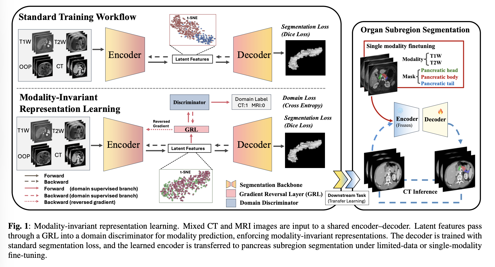
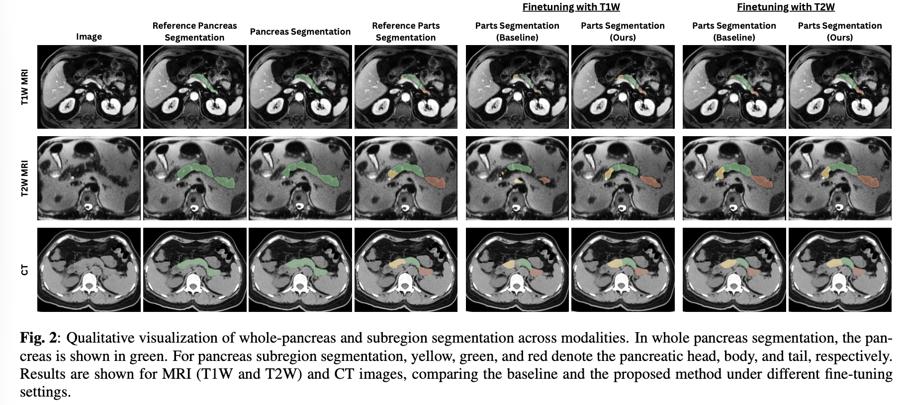

## PancreasSubRegion-Segmentation

> Pancreas subregion segmentation(head, tail and body). 

<p align="center">
  
</p>


---

### Pretrained weights
> Why not solve this problem with one model? Try this on three modalities --> T1W, T2W, and CT.
Pretrained weights (`checkpoint_best.pth`) for this project are available on Google Drive:

- [`PancreasPartsSegmentation` weights folder](https://drive.google.com/drive/folders/1-zfIPTpWc44a1RzEla7pSO52B3pvPJbg?usp=sharing)

Download `checkpoint_best.pth` from this folder and place it into your chosen `model_folder` (see below).

---
### Installation

1. **Clone** this repository:

```bash
git clone <your-pancreas-subregion-repo-url>
cd PancreasSubRegion-Segmentation
```

2. **Create and activate** the conda environment:

```bash
conda env create -f environment.yml
conda activate pancreas_sub_seg  # or rename/change as you prefer
```

3. **Install in editable mode** (recommended):

```bash
pip install -e .
```

Make sure that your CUDA drivers match the versions in `environment.yml` if you want GPU inference.

---

### Model folder layout

`simple_inference.py` expects a **model folder**:

```text
model_folder/
  checkpoint_best.pth
  dataset.json
  plans.json
```

These files should be produced by training with nnU-Net v2 using a configuration that is compatible with the subregion architecture (e.g. where `UNet_subregion` was used as the network). Alternatively, you can use the pretrained `checkpoint_best.pth` from the Google Drive link above and pair it with the appropriate `dataset.json` and `plans.json`.

---

### Command-line inference

To run inference on a **single NIfTI file**:

```bash
python simple_inference.py \
  -i /path/to/input_image.nii.gz \
  -o /path/to/output_segmentation.nii.gz \
  -m /path/to/model_folder \
  -d cuda \
  -v
```

**Arguments:**

- `-i, --input`  
  Path to the input NIfTI volume (`.nii.gz`).

- `-o, --output`  
  Desired output segmentation path.  
  Internally, the script strips the extension, appends the dataset-specific `file_ending` (from `dataset.json`, defaulting to `.nii.gz`), and writes using the correct orientation and spacing.

- `-m, --model`  
  Path to the **model folder** containing `checkpoint_best.pth`, `dataset.json`, `plans.json`. Default: `Model`.

- `-d, --device`  
  Device: `cpu`, `cuda`, or `mps`.  
  When `cuda` is used, most operations are kept on the GPU for speed.

- `-v, --verbose`  
  If set, prints detailed logs(Optional, if you are just running inference, ignore):
  - Image shape and spacing.
  - Whether `nibabel_stuff` / `sitk_stuff` is present in properties.
  - Shapes at each preprocessing / prediction step.
  - Orientation checks before and after export.

---

### Programmatic inference

You can also call the inference API from Python:

```python
from simple_inference import run_inference

run_inference(
    input_file="/path/to/input_image.nii.gz",
    model_folder="/path/to/model_folder",
    output_file="/path/to/output_segmentation.nii.gz",
    device="cuda",   # or "cpu", "mps"
    verbose=True,
)
```

Or use the `CleanInference` class directly:

```python
from simple_inference import CleanInference
import torch

engine = CleanInference(
    model_folder="/path/to/model_folder",
    device=torch.device("cuda"),
    verbose=True,
)

engine.predict_single_file(
    input_file="/path/to/input_image.nii.gz",
    output_file="/path/to/output_segmentation.nii.gz",
)
```

<p align="center">
  

</p>
---

### Contact

This code is primarily intended for internal research use.  
Adapt paths, trainer configuration, and dataset filtering logic as needed for your own setup.

